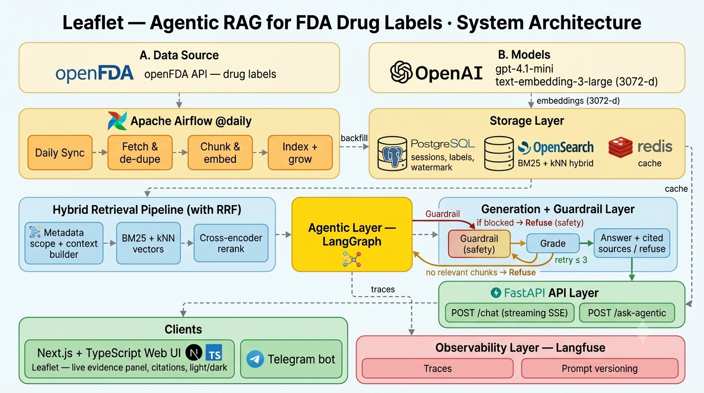

# 🌿 Leaflet — Agentic RAG for FDA Drug Labels

**An agentic Retrieval-Augmented Generation assistant that answers questions about FDA-approved drugs — grounded strictly in official FDA drug-label text, with validated citations, a safety guardrail, and a graceful refusal when the labels don't cover it.**

[](https://github.com/mhdmirzaa/AgenticRAGOpenFDA/actions/workflows/ci.yml)
[](https://github.com/mhdmirzaa/AgenticRAGOpenFDA/actions/workflows/security.yml)




## 🔍 What this is

Leaflet is a production-style **agentic RAG** system over the [openFDA](https://open.fda.gov/) drug-label API. Instead of a single retrieval pass, a LangGraph agent **rewrites weak queries, retrieves iteratively, grades its own evidence, and either answers with citations or refuses** — and a safety guardrail runs first to block unsafe questions before any retrieval. Every answer is traceable end-to-end, streamed live to a Next.js UI (and a Telegram bot), and drawn only from the exact label sections that survived grading.

## 👤 About this project

I built Leaflet as a personal project — for fun and for learning. My goal was to widen and deepen my knowledge in AI engineering by taking a production-grade agentic RAG system end to end myself: retrieval and reranking, self-grading and refusal, honest evaluation, and full-stack deployment across a real service rather than a notebook.

Some of the most valuable lessons came from things *not* going as expected — measuring that hybrid retrieval actually **lost** to plain dense embeddings on this corpus and choosing to report that honestly instead of tuning it away, and wiring up the production concerns (a safety guardrail, auth, CI, observability, evaluation) that rarely show up in a quick prototype. It's the kind of hands-on, end-to-end build I find genuinely fun.

## 🧩 Features

- **Agentic loop** — `guardrail → route → rewrite → retrieve → rerank → grade → decide → generate / refuse`, capped at 3 self-correcting iterations.
- **Safety guardrail (first node)** — blocks self-harm / overdose, dangerous misuse, prompt injection, and requests for personalized medical advice *before* retrieval; caring vs. neutral refusal tone by category.
- **Hybrid retrieval** — OpenSearch **BM25 + kNN** vectors fused with Reciprocal Rank Fusion (RRF), plus an optional cross-encoder rerank.
- **Metadata-scoped retrieval** — resolves which drug(s) a question is about and restricts the search to them before the similarity pass.
- **Validated citations** — every citation is checked against the graded chunk ids; a marker only survives if it maps to real evidence.
- **Live evidence panel** — the agent's reasoning streams in real time (Safety → Scope → Search → Grade → Decide) with PASS/FILTERED chunk cards.
- **Continuous corpus growth** — a daily openFDA sync fetches new labels, deduped by `label_id` and idempotently indexed.
- **Two clients** — a Next.js + TypeScript "Leaflet" web UI and a Telegram bot, both on the identical backend.
- **Production hardening** — API-key auth, rate limiting, IDOR / injection / XSS defenses, security headers, structured logging, `/metrics`, and CI (see [`docs/SECURITY.md`](docs/SECURITY.md)).
- **Evaluation harness** — a golden set scored on Hit@k, MRR, faithfulness, and citation/refusal accuracy (see [`docs/metrics.md`](docs/metrics.md)).

## 🛠 Tech stack

Every layer is a deliberate, production-minded choice — and the whole stack comes up with a single `docker compose up`.

| Layer | Technology | Role |
|---|---|---|
| Data source | **openFDA API** (`/drug/label.json`) | Keyless ingestion of official FDA drug-label text |
| Orchestration | **Apache Airflow** (`@daily`) | Scheduled ingestion + continuous corpus growth (in-process APScheduler fallback) |
| Primary store | **OpenSearch** | BM25 + kNN hybrid retrieval via RRF (embedded Chroma fallback) |
| Persistence | **PostgreSQL** | Drug labels + chat sessions / messages / memory |
| Cache | **Redis** | Query-embedding, retrieval, and final-answer caches (in-memory LRU fallback) |
| Generation | **OpenAI `gpt-4.1-mini`** | Answer generation, chunk grading, entity resolution |
| Embeddings | **OpenAI `text-embedding-3-large`** (3072-d) | Dense vectors for kNN retrieval |
| Reranker | **`BAAI/bge-reranker-base`** | Cross-encoder rerank (baked into the Docker image, loads offline) |
| Agent | **LangGraph** | Stateful agentic loop with guardrail, grading, and refusal |
| API | **FastAPI** (SSE) | Token-streaming `/chat` + REST endpoints |
| Web client | **Next.js + TypeScript** | "Leaflet" emerald medical-hub UI — streaming, citations, live evidence panel, light/dark |
| Messaging client | **Telegram** (python-telegram-bot) | Second client on the same guarded backend |
| Observability | **Langfuse** | Per-request tracing of nodes, chunks, prompts, tokens, latency (optional, graceful no-op) |
| Packaging | **Docker Compose** | One-command full stack |
| Testing | **pytest + Playwright** | 271 backend tests + 5/5 browser e2e, gated in CI |

## ⚖️ Traditional RAG vs Agentic RAG

| Aspect | Traditional RAG | Agentic RAG (this system) |
|---|---|---|
| Retrieval | Single fixed pass | Multi-pass (≤ 3), self-correcting |
| Query handling | Direct embedding | Route + rewrite / coreference resolution |
| Quality control | None | Grades every chunk before answering |
| Out-of-scope | Hallucinates | Graceful, explicit refusal |
| Safety | None | Guardrail blocks unsafe intent *before* retrieval |
| Citations | Basic or none | Validated against graded chunk ids |
| Transparency | Black box | Full decision trace + Langfuse spans |

## 📊 Evaluation

Measured live with `gpt-4.1-mini` + `text-embedding-3-large` over **OpenSearch**. Corpus: **332 FDA labels / 3,054 section chunks** grown from the openFDA API. Golden set: **50 questions** (39 single-hop, 6 multi-hop across two drugs, 5 unanswerable/refusal). Full method and raw runs in [`docs/metrics.md`](docs/metrics.md).

**Best configuration** (dense retrieval + metadata scoping, drug-tagged 312-label index):

| Metric | Score |
|---|---:|
| Hit@1 | **0.90** |
| MRR | **0.907** |
| Refusal correctness | **1.00** |
| Faithfulness (LLM judge) | **0.978** |

**Honest finding — dense beats hybrid on this corpus.** On the grown 332-label set, dense-only retrieval leads hybrid+rerank (**Hit@1 0.800 vs 0.720**, MRR 0.812 vs 0.750). Every FDA label shares the *same* section names (`warnings`, `contraindications`, …), so BM25 fusion pulls the *wrong drug's* same-named section into the top ranks while strong dense embeddings encode drug identity and avoid it. This was root-caused with a retrieval-only diagnostic and **reported as-is, not tuned away**. Metadata scoping is the fix that recovers the hybrid path — lifting **optimized Hit@1 0.80 → 0.86** and MRR 0.837 → 0.885.

**Performance wins** (all measured live):

| Optimization | Cold | Warm / after |
|---|---:|---:|
| Batched grading (one LLM call for all candidates) | ~12,438 ms | **~2,080 ms** (5.98×) |
| Final-answer cache (exact-repeat questions) | ~14,079 ms | **< 1 ms** |
| Retrieval-step cache (embedding + hybrid search) | ~1,905 ms | **~0.78 ms** |

## 🚀 Quick start

**Docker (full stack):**

```bash
cp .env.example .env          # set OPENAI_API_KEY
docker compose up             # backend :8000 · frontend :3005 · Postgres · OpenSearch · Airflow :8080 · telegram-bot

# build the index (or use the "Sync labels" action in the UI)
curl -X POST http://localhost:8000/ingest/fda
# then open http://localhost:3005

# optional overlays:
docker compose -f docker-compose.yml -f docker-compose.redis.yml -f docker-compose.langfuse.yml up
```

**Run the evaluation** (live stack up, index built):

```bash
OPENSEARCH_URL=http://localhost:9200 EMBED_MODEL=text-embedding-3-large python -m eval.run --mode baseline
OPENSEARCH_URL=http://localhost:9200 EMBED_MODEL=text-embedding-3-large python -m eval.run --mode optimized
```

**Run the tests:**

```bash
cd backend && DISABLE_RERANKER=1 HF_HUB_OFFLINE=1 python -m pytest -q   # 271 passed
```

## 📁 Repository layout

```
.
├── backend/     FastAPI + LangGraph agent — agent, api, ingestion, retrieval, providers, telegram, security
├── frontend/    Next.js + TypeScript "Leaflet" UI — streaming, citations, live evidence panel, light/dark
├── airflow/     openFDA ingestion DAG (@daily + continuous growth)
├── eval/        golden-set harness (Hit@k, MRR, faithfulness, refusal)
├── corpus/      seed corpus assets used by the ingestion/loader path
├── docs/        PRD, DESIGN, metrics, SECURITY, DEPLOYMENT, OPERATIONS, PROJECT_REPORT, PROJECT_STRUCTURE
└── docker-compose*.yml   full stack + optional Redis / Langfuse overlays
```

Full file-by-file map: [`docs/PROJECT_STRUCTURE.md`](docs/PROJECT_STRUCTURE.md). Design system: [`docs/DESIGN.md`](docs/DESIGN.md). Requirements: [`docs/PRD.md`](docs/PRD.md). Complete write-up: [`docs/PROJECT_REPORT.md`](docs/PROJECT_REPORT.md).

## ⚕️ Disclaimer

**Informational only — not medical advice.** Answers are drawn solely from FDA drug-label text and may be incomplete or outdated. Always consult a qualified healthcare professional for medical decisions. This disclaimer is enforced in the UI and appended to every generated answer.
